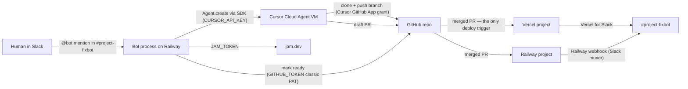

# Implementation guide: stand this stack up from scratch

This file is written to be **executed by an AI agent**, with a human on hand for
the steps only a human can do. `README.md` teaches the SDK, `ARTICLE.md` and
`ARTICLE-SLACK.md` tell the story; this is the recipe. Every credential, every
scope, every grant, in the order they are needed, with a command that proves each
one before the next phase starts.

The proof command is `npm run doctor`. It is read-only: it never fires a deploy
hook, never posts to Slack, never creates or mutates anything. Run it after every
phase.

---

## How an agent should use this file

Work the phases in order, A through G. Each phase has the same four parts:

- **Preconditions** — what must already be true. If it is not, go back a phase.
- **Do** — the commands and edits to make. Safe to run unattended.
- **Verify** — `npm run doctor -- --phase <letter>`. Do not advance on a FAIL.
- **Human gate** — the part you cannot do. Stop, print exactly what you need,
  wait for the human to say it is done, then re-run Verify.

Rules for the agent:

1. **Never invent a credential.** If a token is missing, that is a human gate,
   not a blocker to work around. Do not create accounts, do not accept terms, do
   not choose a paid plan.
2. **Never open an OAuth flow.** Anything that ends in a browser consent screen
   (Cursor's GitHub grant, Slack install, Vercel for Slack, `/vercel signin`) is
   a human gate. You can *check* the result; you cannot *perform* it.
3. **Secrets go in `.env` or the host's variable store, never in the repo, never
   in a Slack message, never in a commit, never in a PR description.** `.env` is
   gitignored; keep it that way.
4. **Read the doctor output before deciding anything.** Every check prints the
   phase it belongs to and a one-line fix hint. FAIL blocks; WARN is a decision
   for the human; SKIP means the feature is not configured, which is fine for the
   optional phases (F, G).
5. `npm run doctor -- --json` is the machine-readable form. Exit code is non-zero
   if any check FAILs.
6. **Never give the bot a deploy credential.** There is no deploy command, by
   design (`ARTICLE-SLACK.md` step 6½). If a task seems to need one, the answer is
   a pull request, not a token.

The minimum viable setup is phases **A through D**: a repo an agent can work, a
Slack app, and a bot you run on your laptop. E makes it survive a closed lid and
gives it a version. F and G are optional and independent of each other.

---

## Architecture



Note the arrow that is absent: nothing goes from the bot to Vercel or Railway.
The bot cannot deploy and holds no credential that could.

Three layers, three owners, and confusing them is the most common way this setup
goes wrong:

- **Cursor hosts the agents.** The Cloud Agent is a VM that clones your repo,
  runs the model, pushes a branch, opens a draft PR. You do not host it.
- **Your host runs the bot.** One long-lived Node process holding a websocket to
  Slack. Railway is what the running example uses. It is not Vercel, and phase E
  says why.
- **Vercel and Railway host the apps** the agent writes code for. They deploy when
  a PR merges, and their own Slack integrations (phase F) post the result. The bot
  is not in that path and has no way to enter it.

The channel convention that makes routing work without typing a project name:
one channel per repo, named `#<project>-fixbot` (`#api-fixbot`, `#web-fixbot`).
The leading segment before the first `-` is the project alias. Any suffix works;
`#api-bugs` behaves identically.

---

## Credential and rights inventory

Every right the stack needs. Nothing here is optional-by-accident: if the
"Needed for" column names a phase you are skipping, skip the credential too.

| Right | Env var | Minted at | Exact scope | Used by | Stored in | Needed for |
| --- | --- | --- | --- | --- | --- | --- |
| Cursor API key | `CURSOR_API_KEY` | cursor.com/dashboard/integrations | whole-account; no scope picker | every script, the bot | `.env` locally, host variables in prod | A (or the stored login), E |
| Cursor stored login | — | `npm run login` | same, 90-day expiry | local scripts only | `~/.cursor/sdk/auth.json` | A |
| Cursor GitHub grant | — | cursor.com/agents → connect GitHub | read + write on the granted repos | the Cloud Agent VM (clone, push, PR) | Cursor's side; nothing local | A, B |
| Local git access | — | your SSH key or gh auth | push to the target repo | you, `git ls-remote` in doctor | `~/.ssh`, ssh-agent | B |
| GitHub PAT | `GITHUB_TOKEN` | github.com/settings/tokens → **classic** | `repo` | the bot, to flip a draft PR to ready | `.env`, host variables | G |
| Slack bot token | `SLACK_BOT_TOKEN` | api.slack.com/apps → Install App | the nine scopes in `slack-app-manifest.json` | the bot | `.env`, host variables | C |
| Slack app token | `SLACK_APP_TOKEN` | Basic Information → App-Level Tokens | `connections:write` | the bot's Socket Mode connection | `.env`, host variables | C |
| Slack incoming webhook | — | same app → Incoming Webhooks | `incoming-webhook`, one URL per channel | **Railway**, to post deploy cards | Railway project settings | F |
| Vercel for Slack link | — | vercel.com/integrations/slack/new + `/vercel signin` | Vercel account ↔ Slack user | `@Vercel`, to post deploy events | Vercel + Slack | F |
| Railway SSH key | — | `railway ssh keys add -k ~/.ssh/id_ed25519.pub` | your account | you, to debug the running bot | Railway account | E, debugging only |
| Jam PAT | `JAM_TOKEN` | jam.dev → Settings → MCP | `mcp:read` (add `mcp:write` only to post comments) | the bot, to read recordings | `.env`, host variables | G |
| Cloud Agent VM secrets | — | Cloud Agents dashboard | per-repo env for the VM | the agent's test run | Cursor's dashboard | B, if tests need secrets |
| Build stamp | `BUILD_INFO` | `npm run deploy` (never by hand) | — (not a secret) | the bot, to report its own commit | host variables | E |

Note what the table does **not** contain: `VERCEL_TOKEN`, `RAILWAY_TOKEN`, a
Vercel deploy hook, or anything else that could ship code. Version 0.1.x had all
four for a `@<bot> deploy` command; 0.2.0 removed the command and the credentials
with it. If you find them in an inherited `.env`, delete them — the doctor warns
while they are set.

Four things worth stating twice, because each one has cost someone an afternoon:

- **`GITHUB_TOKEN` must be a classic PAT.** GitHub's
  `markPullRequestReadyForReview` mutation rejects every fine-grained PAT and
  every App/Actions installation token with "Resource not accessible by personal
  access token", no matter which permissions you grant, and there is no REST
  equivalent. See the note at the top of [src/lib/github.ts](src/lib/github.ts).
- **The Cursor GitHub grant is not the same as your own git access.** You can
  `git push` all day and still have Cloud Agents fail to clone, because the
  Cursor GitHub App was never granted that repo. `npm run doctor -- --phase A`
  checks the grant; `--phase B` checks yours.
- **The bot has no deploy path, and that is a requirement, not an omission.** A
  merged PR is the only trigger. Do not add a deploy token to the bot's
  environment to "make shipping faster"; the reasoning is in
  [ARTICLE-SLACK.md](ARTICLE-SLACK.md) step 6½, and phase F is how status still
  reaches the channel.
- **Secrets the *agent* needs are not secrets the *bot* needs.** If the target
  repo's tests need a database URL, that goes in the Cloud Agents dashboard and
  `.cursor/environment.json` describes the VM. It does not go in the bot's `.env`
  and it certainly does not go in Slack.

---

## Phase A: local bootstrap

Condenses [README.md](README.md) §2 and [ARTICLE.md](ARTICLE.md) step 0.

**Preconditions:** Node 22.13+, a paid Cursor plan, a GitHub account.

**Do:**

```bash
git clone https://github.com/rvegajr/cloud-agents
cd cloud-agents
npm ci
cp .env.example .env
npm run login          # or paste a key into .env as CURSOR_API_KEY
npm run status         # account, models, connected repos
```

Set in `.env`: `CURSOR_MODEL` (default `composer-2.5`), `TARGET_REPO`,
`TARGET_REF` — the *integration* branch, which in many repos is `develop`, not
`main`.

**Verify:** `npm run doctor -- --phase A`

**Human gate:** connecting GitHub to Cursor. Go to
[cursor.com/agents](https://cursor.com/agents), connect GitHub, grant the target
repo (or the whole org). Until that is done, `TARGET_REPO` will not appear in the
connected-repos list and every cloud run fails at clone. An agent cannot click
this consent screen.

---

## Phase B: make the target repo agent-ready

Condenses [ARTICLE-SLACK.md](ARTICLE-SLACK.md) step 1.

**Preconditions:** phase A green.

**Do:** copy the kit into the **target** repo, not this one.

```bash
cp target-repo-kit/AGENTS.md /path/to/your-repo/
cp -R target-repo-kit/.cursor /path/to/your-repo/
```

Then fill in `AGENTS.md`. The blanks that actually decide whether unattended runs
work:

- **Commands.** Install at the root, test in a subdirectory? Write both.
- **Integration branch.** Match `TARGET_REF`. The shell hook blocks pushes to
  `main`, `master`, *and* `develop`.
- **Tests the agent can actually run.** If `npm test` needs Docker or a paid API,
  say so and give the agent the subset that works in a fresh clone. Typecheck
  plus unit tests is enough.
- **Never.** CI config, deploy files, existing migrations. Prompts will not hold
  this line; `.cursor/hooks.json` and this list will.

Delete or scope any legacy `.cursorrules` written for interactive chat — "ask
before acting" is correct for a human session and fatal for a bot. The kit's
`.cursor/rules/autonomous-agent.mdc` is `alwaysApply` and states the unattended
posture instead.

Prove the repo clones and the layout is legible with a read-only run:

```bash
npm run pipeline -- --repo https://github.com/you/your-repo \
  --ref develop --brief example-health-endpoint --plan-only
```

Use a brief that is deliberately wrong for the repo. You are not landing a health
endpoint; you are checking for `[status] CREATING`, a clone, and a plan that
mentions the real layout.

**Verify:** `npm run doctor -- --phase B` — it proves *your* git access to every
configured repo and branch, which is a different right from the Cursor grant that
phase A checked. Set `TARGET_REPO_PATH` in `.env` to a local clone and it also
confirms `AGENTS.md`, `.cursor/hooks.json`, and `guard-shell.mjs` actually landed,
and that `AGENTS.md` is no longer the unedited template.

**Human gate:** if the repo's tests need system packages or secrets, describe the
VM in `.cursor/environment.json` and put the secrets in the Cloud Agents
dashboard. Both are decisions about what the agent is allowed to reach, so a
human makes them.

---

## Phase C: create the Slack app

Condenses [ARTICLE-SLACK.md](ARTICLE-SLACK.md) step 2.

**Preconditions:** phase B green, and permission to create an app in the
workspace.

**Do (agent side):** nothing but the `.env` edits below. Everything else in this
phase is a human gate, because it is all browser consent.

**Human gate** — hand the human this list verbatim:

1. [api.slack.com/apps](https://api.slack.com/apps) → **Create New App** → **From
   an app manifest**. Paste [slack-app-manifest.json](slack-app-manifest.json).
   Rename it freely; whatever you call it is the `@<bot>` handle from here on,
   and the bot reads its own name from Slack at startup.
2. **Basic Information → App-Level Tokens** → generate one with
   `connections:write`. That is `SLACK_APP_TOKEN` (`xapp-…`).
3. **Install App** → copy the **Bot User OAuth Token**. That is
   `SLACK_BOT_TOKEN` (`xoxb-…`).
4. Create `#<project>-fixbot` per repo and `/invite @<bot>` into each.

Then set in `.env`:

```
SLACK_BOT_TOKEN=xoxb-...
SLACK_APP_TOKEN=xapp-...
SLACK_PROJECTS=api=https://github.com/you/api@develop,web=https://github.com/you/web@develop
SLACK_ALLOWED_CHANNELS=C0123ABCD,C0456EFGH
SLACK_MAX_CONCURRENT=2
```

One repo needs only `TARGET_REPO` / `TARGET_REF`. Several need `SLACK_PROJECTS`.
`SLACK_CHANNEL_REPOS` handles channels that are *not* named after their project;
mapped channels are implicitly allowed. An empty `SLACK_ALLOWED_CHANNELS` means
every channel the bot is in, which is fine for the first hour and sloppy after
that.

**Verify:** `npm run doctor -- --phase C` — proves both tokens, diffs the granted
bot scopes against the manifest, resolves every allowlisted channel, and confirms
the bot is actually a member of each.

---

## Phase D: run the bot locally and prove the loop

Condenses [ARTICLE-SLACK.md](ARTICLE-SLACK.md) step 3.

**Preconditions:** phase C green.

**Do:**

```bash
npm run slack
```

Expect a Socket Mode line naming the bot as Slack knows it, the project routing
table, and the usage text. Then, in `#api-fixbot`, from a human's Slack account:

```
@<bot>                                    prints usage
@<bot> api                                prints that project's options
@<bot> the settings page 500s after logout starts a job
```

The first reply in the thread contains a line you must not edit:

```
agent: bc-…
```

That `bc-` id is a real Cloud Agent, visible at
[cursor.com/agents](https://cursor.com/agents) under Source → SDK, and it is what
a reply in the same thread resumes.

**Verify:** `npm run doctor -- --phase D`, plus one real mention that reaches a
draft PR. The doctor can prove every credential; only a mention proves the loop.

**Human gate:** the mention itself. A bot cannot @-mention another bot into
starting work, and you want a human to read the first triage reply anyway.

---

## Phase E: host the bot

Condenses [ARTICLE-SLACK.md](ARTICLE-SLACK.md) step 8.

**Preconditions:** phase D green, including one successful end-to-end mention.

Socket Mode works the same on a server: the process dials **out** to Slack and
holds the websocket open. No domain, no TLS, no signing secret. What you need is
a host that keeps one Node process alive — which is exactly why the bot does not
run on Vercel, even though the apps it works on do. Vercel Functions are
request-scoped; a websocket that must stay open between mentions does not fit.
Running there would mean Bolt in HTTP mode (public Request URL, request signing,
3-second ack) plus a queue for the minutes-long pipeline.

**Do:**

```bash
railway login
railway init
railway variables --set "SLACK_BOT_TOKEN=$SLACK_BOT_TOKEN" \
  --set "SLACK_APP_TOKEN=$SLACK_APP_TOKEN" \
  --set "TARGET_REPO=$TARGET_REPO" \
  --set "TARGET_REF=$TARGET_REF" \
  --set "CURSOR_API_KEY=$CURSOR_API_KEY" \
  --set "CURSOR_MODEL=composer-2.5" \
  --set "JAM_TOKEN=$JAM_TOKEN" \
  --set "SLACK_ALLOWED_CHANNELS=$SLACK_ALLOWED_CHANNELS" \
  --set "SLACK_PROJECTS=$SLACK_PROJECTS" \
  --set "SLACK_CHANNEL_REPOS=$SLACK_CHANNEL_REPOS" \
  --set "SLACK_MAX_CONCURRENT=10" \
  --set "GITHUB_TOKEN=$GITHUB_TOKEN"
npm run deploy                  # stamps BUILD_INFO, then railway up
railway logs
```

That variable list is deliberately short. Do not add `VERCEL_TOKEN`,
`RAILWAY_TOKEN`, or a deploy hook: the bot has no deploy path (`ARTICLE-SLACK.md`
step 6½), and giving it one is the single change this guide asks you not to make.

`CURSOR_API_KEY` on the server has to be a real key from
cursor.com/dashboard/integrations. The browser login from phase A lives in your
home directory and does not travel.

**Use `npm run deploy`, not a bare `railway up`.** It runs `npm run stamp` first,
which reads `git describe` and sets `BUILD_INFO` on the service with
`--skip-deploys` so it does not queue a second build. Without it the container
cannot report which commit it is running: `railway up` honours `.gitignore`
(so a generated `version.json` never ships) and a built image has no `.git`.

Register an SSH key once per machine so you can debug the live container:

```bash
railway ssh keys list
railway ssh keys add -k ~/.ssh/id_ed25519.pub -n "laptop"
railway ssh                     # then: env | grep BUILD_INFO, logs, etc.
```

[railway.json](railway.json) installs the Jam CLI if missing, runs
`npm run slack`, and restarts on failure. `tsx` is a runtime dependency on
purpose, so `NODE_ENV=production` cannot skip it.

**Verify:** `npm run doctor -- --phase E` (which also compares the stamp against
`HEAD` and warns when they differ), then `railway logs` showing the version line
and the Socket Mode banner, then `@<bot> version` from your phone.

**Human gate:** `railway login` is a browser flow, and choosing which Railway
workspace pays for this service is a spending decision.

### Releasing

Once it is hosted, releases are semver tags plus a changelog entry, so a version
number means something when someone asks which build has the fix:

```bash
# move CHANGELOG.md's Unreleased section under the new version, then:
npm version minor -m "release: v%s"     # bump package.json, commit, annotated tag
git push --follow-tags
npm run deploy
```

Bump the minor for a behaviour change, the patch for a fix. `--follow-tags` is
what stops you pushing the commit and leaving the tag on your laptop. An agent can
do all of this; deciding that a change deserves a release is a human call.

---

## Phase F: deploy status in the channel (optional)

Condenses [ARTICLE-SLACK.md](ARTICLE-SLACK.md) addendums A and B. This is the
merge-to-live line: GitHub → host → `#<project>-fixbot`. **No bot code, no
tokens in `.env`, and nothing the bot can trigger.** The doctor cannot verify any
of it from outside, so the check for this phase is a printed checklist and the
real proof is a merge.

This is also where expectations get set wrong, so state it plainly: the "done"
card fires when **the host finishes deploying**, not when GitHub finishes PR
checks. On a PR, Vercel posts when the *preview* is ready; Railway posts nothing
unless you opted into PR environments. On a merge, both post when the real
deployment finishes.

**Vercel projects** — entirely a human gate:

1. Install from
   [vercel.com/integrations/slack/new](https://vercel.com/integrations/slack/new).
   That is an **Integration**. Vercel's **Connect** page is a different product
   (managed OAuth to third-party APIs) and is not this.
2. In the channel: `/invite @Vercel`, then `/vercel signin` and complete
   **Connect to Slack** while already logged into Vercel in the browser. If Slack
   emails you a six-character code instead, you are on the app-install path, not
   the user-link step; finish that first, then sign in.
3. `/vercel subscribe your-team/your-project` — the slug pair from the vercel.com
   URL.
4. Subscribe to **Deployment Succeeded** and **Deployment Error**. Leave
   **Deployment Created** off or every push is two messages.
   `/vercel subscribe list` reprints what the channel gets.

If your integration branch is not `main`, a merge to `develop` is a **preview**
deployment. Subscribing to production events only will leave the channel silent
after exactly the merge you care about. And `/vercel subscribe` has to be a real
slash command; pasting it as a message does nothing.

**Railway projects** — Railway ships no Slack app. It ships project webhooks, and
when the URL is on `hooks.slack.com` it reformats the payload itself (Railway
calls that a muxer). Also a human gate:

1. Same Slack app → **Incoming Webhooks** → **On**. Slack asks you to
   **reinstall** so the `incoming-webhook` scope takes effect. That does not
   rotate the `xoxb-` token unless you click **Revoke All OAuth Tokens**. Do not.
2. **Add New Webhook to Workspace** → pick `#web-fixbot` → Allow. One URL is one
   channel; add a second webhook for a second channel. Treat the URL as a secret.
3. Railway dashboard → the **target** project (the app, not the bot) → **Settings
   → Webhooks** → paste the URL. Turn on **Deployment Deployed** and **Deployment
   Failed**, plus the critical set (crashed, OOM, volume, monitor) if you want
   incidents in the same channel. Leave **Include PR environments** off unless
   preview envs should post to the fixbot channel.
4. Ignore **Test Webhook**. Railway sends that click from the browser, so CORS
   reports failure on URLs that are fine. `curl -X POST -d '{"text":"hi"}'` the
   Slack URL instead, or wait for a real deploy.

A webhook is per **project**, not per service or environment — every environment
in that project posts to the same URL. Railway's public GraphQL API has
`webhookTest` but no create mutation, and config-as-code cannot do it either. The
dashboard is the only store.

**Verify:** `npm run doctor -- --phase F` prints this checklist. The real
verification is a merge that produces a card in the channel.

---

## Phase G: Jam evidence and ready-for-review (optional)

**Preconditions:** phase D green.

**Do:**

```
JAM_TOKEN=...        # jam.dev → Settings → MCP, scope mcp:read
GITHUB_TOKEN=ghp_... # classic PAT, repo scope
```

`JAM_TOKEN` is what turns a pasted [jam.dev](https://jam.dev) link into console
errors, failed requests, a click path, and a video summary inside the agent's
prompt. Without it the bot sees a URL and the agent triages from prose. The
`jam` CLI self-installs on first fetch when the token is present.

`GITHUB_TOKEN` flips a Cloud Agent's PR from draft to ready once the verifier
reports done — a failed verify leaves it a draft. Cloud Agents always open drafts
and most auto-merge setups ignore drafts, so without this every unattended run
parks on "someone click Ready."

**Verify:** `npm run doctor -- --phase G`. It confirms the Jam CLI and token, and
that `GITHUB_TOKEN` is a classic PAT carrying `repo` — the check that catches the
fine-grained-PAT trap before a PR silently stays a draft.

**Human gate:** minting both tokens. Give the PAT a short expiry and put it only
in the bot's own environment.

---

## Secrets hygiene

| Secret | Lives in | Never in |
| --- | --- | --- |
| Cursor stored login | `~/.cursor/sdk/auth.json` (mode 600, machine-local) | anywhere else; it does not travel to a server |
| `CURSOR_API_KEY` | gitignored `.env`, host variable store | the repo, CI logs, Slack |
| Slack `xoxb-` / `xapp-` | gitignored `.env`, host variable store | the repo, a channel, a PR |
| Slack incoming webhook URL | Railway project settings | the repo, the bot's `.env`; it is a bearer credential in URL form |
| `GITHUB_TOKEN`, `JAM_TOKEN` | gitignored `.env`, host variable store | the repo, Slack, the agent's prompt |
| Secrets the target repo's *tests* need | Cloud Agents dashboard, described by `.cursor/environment.json` | the bot's `.env`, `AGENTS.md`, Slack |
| Anything that can deploy | your platform's own permission model | the bot, in any form (see phase E) |

Least privilege, in the order it pays off:

1. Give the bot no deploy credential at all. This is free, and it is the largest
   single reduction in what a compromised Slack message can do.
2. Set `SLACK_ALLOWED_CHANNELS`. Empty means "anyone, anywhere the bot was
   invited."
3. Give `GITHUB_TOKEN` a short expiry. It exists for one GraphQL mutation.
4. Keep `SLACK_MAX_CONCURRENT` at a number you would be happy to pay for.
5. Rotate by replacing the host variable and redeploying; never by committing a
   new value "temporarily."

`npm run doctor` also checks the boring failure: that `.env` is not tracked by
git and that `.runs/` is ignored.

---

## Handoff checklist

The setup is done when all of these are true:

- [ ] `npm run doctor` exits 0 with no FAILs, and every WARN is one a human has
      seen and accepted.
- [ ] `npm run status` lists the target repo under connected repos.
- [ ] A human mention in `#<project>-fixbot` produced a thread with an
      `agent: bc-…` line and a draft PR.
- [ ] A reply in that same thread resumed the same agent rather than starting a
      new one.
- [ ] The bot survives a redeploy: `railway logs` shows the version line and the
      Socket Mode banner after `npm run deploy`.
- [ ] `@<bot> version` reports the commit you just shipped, sourced from
      `BUILD_INFO`.
- [ ] The service has no `VERCEL_TOKEN`, `RAILWAY_TOKEN`, `SLACK_DEPLOYS`, or
      `SLACK_DEPLOYERS` variable.
- [ ] (F) A merge produced a deploy card in the channel from `@Vercel` or the
      Railway webhook.
- [ ] (G) A verified PR came out of draft on its own.
- [ ] `git status` is clean and `git ls-files` includes neither `.env` nor
      `version.json`.

When something breaks later, run `npm run doctor` first. It is faster than
reading logs and it distinguishes "a credential expired" from "the code is
wrong," which are the two things that actually go wrong in production.
